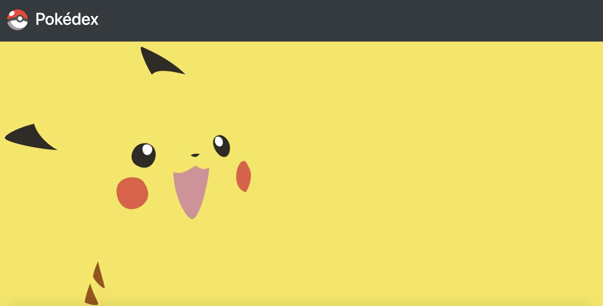

# Pokedex Lab

You've already worked with the [PokéApi](https://pokeapi.co/) in class. Now it's time to use it on your own! Using the API, create a Pokédex where users can not only browse a list of Pokémon characters, but also search for their favorites!

Starter code is provided for you, which includes some HTML and CSS. Bootstrap is already linked in the `head` of the HTML boilerplate, and your `script` file is connected in the `body`.

## Prerequisites

* DOM & Events
* Bootstrap & Responsive Design
* APIs & AJAX

## Instructions

1. Fork and clone this repository.
2. Change into the new directory.
3. Fulfill the listed requirements.
4. Submit your solution with a pull request on this repository.

Please turn in your submission by the deadline on your cohort calendar.

## Requirements

1. Using Bootstrap, create a submit button called "Catch 'Em All!" that, when clicked, makes a request to the PokéApi and lists all Pokémon in the browser. Each character should appear in the DOM in a Bootstrap card and include the Pokémon's name. 
2. Add an input field/search bar with a submit button called "Search". When the user enters the name of the Pokémon and clicks submit, a request is made to the PokéApi and the approprate Pokémon's Bootstrap card will appear in the DOM.
3. Add a Bootstrap dropdown menu that includes the following options: Name, ID, Ability, Location and Move.
4. Focus the search based on the option the user selects for the dropdown menu. When the Search button is clicked, make a request to the PokéApi to search the Pokémon property that matches the selected option for what is in the input field.
5. If the input does match any data from the PokéApi, create an alert that says "No matches! Try something else!"

## Bonus

Make your Pokédex responsive using the Bootsrap grid!

## Plagiarism

Take a moment to refamiliarize yourself with the [Plagiarism policy](https://git.generalassemb.ly/DC-WDI/Administrative/blob/master/plagiarism.md). Plagiarized work will not be accepted.

## [License](LICENSE)

1.  All content is licensed under a CC­BY­NC­SA 4.0 license.
2.  All software code is licensed under GNU GPLv3. For commercial use or
    alternative licensing, please contact legal@ga.co.
